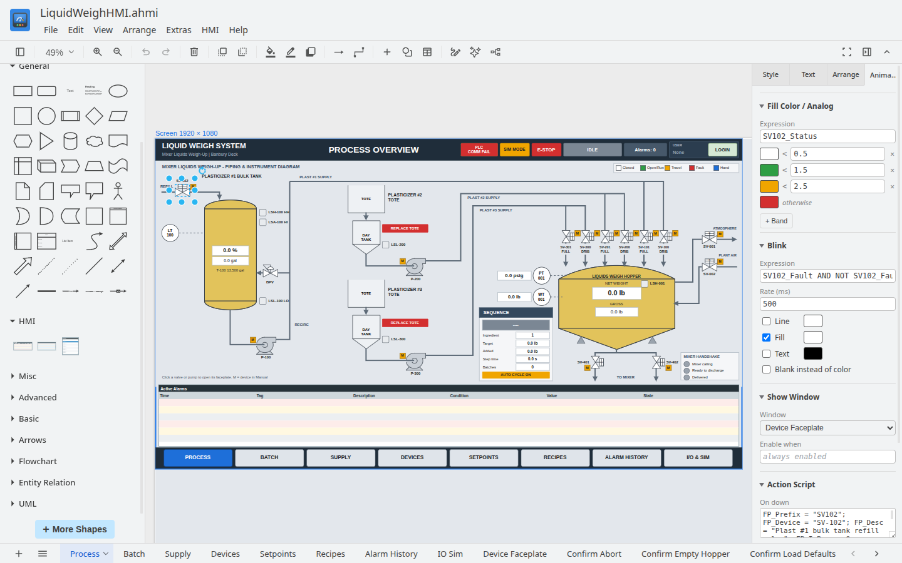

Append HMI Studio
=================

**Append HMI Studio** designs operator screens (HMIs) for PLCs, runs them against live equipment, and publishes them as Windows installers for the target PC.



- **Design** screens on a diagram canvas, with tags, animation links, window properties and scripts.
- **Run** them in the editor against real devices through the bundled comms server:
  - EtherNet/IP ControlLogix/CompactLogix;
  - SLC 5/05 and MicroLogix;
  - Modbus TCP;
  - a built-in simulator.
- **Alarms**: analog and discrete alarms with acknowledgement, the `_AlarmsActive`, `_AlarmsUnacked` and `_AckAll` system tags, Alarm List and Alarm History objects, and daily CSV history. See [doc/HMI_ALARMS.md](doc/HMI_ALARMS.md).
- **Retentive memory tags** keep their last value from one run to the next.
- **Users and security**: users with access levels 0–9999, a built-in login window, the `_Username` and `_AccessLevel` system tags, login script functions, masked password entry and the Enable animation. See [doc/HMI_SECURITY.md](doc/HMI_SECURITY.md).
- **Indirect tags**: `IndirectDiscrete`, `IndirectAnalog` and `IndirectMessage` tags that a script points at any tag with `LinkIndirectTag("Indirect", "Tag")`, so one faceplate serves many devices. See [doc/HMI_INDIRECT.md](doc/HMI_INDIRECT.md).
- **Recipes**: recipe books of tag values with optional paired PLC tags, script functions to save, load, upload, download, export, import, delete, rename and select recipes, and a Recipe List object. Recipes saved at run time are kept on the running PC. See [doc/HMI_RECIPES.md](doc/HMI_RECIPES.md).
- **Automation**: build, check, render and publish projects from the command line or a script, from a plain JSON spec. See [doc/HMI_AUTOMATION.md](doc/HMI_AUTOMATION.md).
- **Publish** a project as a Windows installer (HMI > Publish). It installs a locked, run-only copy of the app with the comms server, built on any platform. See [doc/HMI_PUBLISH.md](doc/HMI_PUBLISH.md).

Projects are saved as `.ahmi` files. Files saved as `.drawio-hmi` by earlier builds still open.

Getting started
---------------

The [User Manual](doc/Append-HMI-Studio-User-Manual.pdf) ([Word](doc/Append-HMI-Studio-User-Manual.docx)) walks through building an application with screenshots, using the [LiquidWeighHMI example](examples/). In short:

1. **Tags:** in **HMI > Devices**, add your PLC (or use the simulator). Then define tags in **HMI > Tag Dictionary**.
2. **Screens:** draw them on the canvas. Each page is a window of the application.
3. **Animation:** select an object and add animation links on the **Animation** tab (colors, fill, movement, value display, touch actions).
4. **Test:** **HMI > Run** runs the project against live or simulated data.
5. **Deploy:** **HMI > Publish** builds a Windows installer for the target PC.

Documentation
-------------

| Topic | Document |
|---|---|
| Building HMI applications, step by step | [User Manual (PDF)](doc/Append-HMI-Studio-User-Manual.pdf) |
| Alarms, system tags, alarm objects and history | [doc/HMI_ALARMS.md](doc/HMI_ALARMS.md) |
| Users, access levels and login | [doc/HMI_SECURITY.md](doc/HMI_SECURITY.md) |
| Recipe books, recipe functions and the Recipe List | [doc/HMI_RECIPES.md](doc/HMI_RECIPES.md) |
| Indirect tags and LinkIndirectTag | [doc/HMI_INDIRECT.md](doc/HMI_INDIRECT.md) |
| Publishing a runtime installer | [doc/HMI_PUBLISH.md](doc/HMI_PUBLISH.md) |
| Command-line automation and the JSON project spec | [doc/HMI_AUTOMATION.md](doc/HMI_AUTOMATION.md) |
| The PLC comms server and its protocol | [comms/README.md](comms/README.md) |
| Building and packaging | [doc/BUILDING.md](doc/BUILDING.md) |
| Releases | [doc/RELEASE_PROCESS.md](doc/RELEASE_PROCESS.md) |

For AI coding agents, [.claude/skills/append-hmi-studio](.claude/skills/append-hmi-studio/SKILL.md) is a Claude Code skill for building and publishing HMI applications from the command line.

Download
--------

Releases are published at [github.com/AppendAutomation/AppendHMIStudio/releases](https://github.com/AppendAutomation/AppendHMIStudio/releases):

- `Append-HMI-Studio-<version>-Setup.exe`
  - Windows 10/11 x64 installer, for all users (administrator rights).
  - Silent install: `/S`. Silent uninstall: `"C:\Program Files\Append HMI Studio\Uninstall.exe" /S`.
- `Append-HMI-Studio-<version>-x86_64.AppImage`: Linux, runs without installing.
- `Append-HMI-Studio-<version>-amd64.deb`: Debian and Ubuntu (`sudo apt install ./Append-HMI-Studio-*.deb`).

The installers are not code-signed yet, so Windows SmartScreen asks for confirmation on first run.

There is no automatic update: install a newer version over the old one.

Settings and logs are kept in `%APPDATA%\Append HMI Studio` (Windows) and `~/.config/Append HMI Studio` (Linux).

Security
--------

The app works offline. Diagram and project data never leave the machine, and the Content Security Policy forbids remotely loaded code. The only network traffic is to the PLCs a project is configured to talk to, through the local `hmi-comms` server.

A diagram can still reference external media (an image or font by URL). That media is fetched when the diagram is opened, so the remote server sees the request, but no diagram content is sent.

Building
--------

See [doc/BUILDING.md](doc/BUILDING.md). In short, with Node.js 22.12+ and the .NET 8 SDK:

```
git clone --recursive https://github.com/AppendAutomation/AppendHMIStudio.git
cd AppendHMIStudio
npm install
npm start                 # run from source
npm run dist-win          # Windows installer (on Linux too, no wine)
npm run dist-linux        # AppImage and deb
```

The repository uses submodules; after a plain clone, run `git submodule update --init --recursive`.

| Path | Contents |
|---|---|
| `src/main/` | Electron main process: windows, IPC, run-only mode, Publish, alarm/retentive/user stores |
| `drawio/` | Submodule: Append Automation's fork of the draw.io editor (branch `hmi`); the HMI code is in `src/main/webapp/js/hmi/` |
| `comms/` | `hmi-comms`, the .NET 8 PLC communications server, with the `cslogix` and `cscomm3_slc` submodules in `comms/lib/` |
| `scripts/` | Build scripts (`dist-win`, `dist-linux`, the Windows runtime template, icons, NSIS download) |
| `build/` | Icons, signing and fuse hooks |
| `src/test/` | Unit tests (`npm test`) |
| `doc/` | Documentation |

License and attribution
-----------------------

Append HMI Studio is © 2026 Append Automation and is licensed under the Apache License 2.0 (see [LICENSE](LICENSE)).

It is built on the [draw.io](https://github.com/jgraph/drawio) diagram editor and [drawio-desktop](https://github.com/jgraph/drawio-desktop) by JGraph Ltd, used and modified under the Apache License 2.0. [NOTICE](NOTICE) lists the third-party works and the changes made. Append HMI Studio is not affiliated with or endorsed by JGraph Ltd; "draw.io" is a trademark of its owner.
